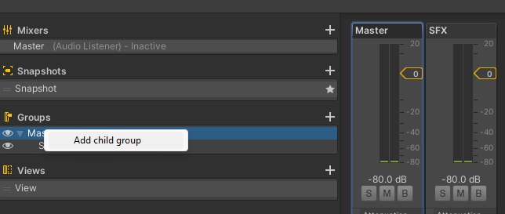
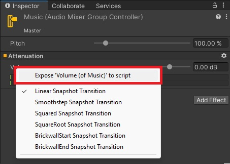
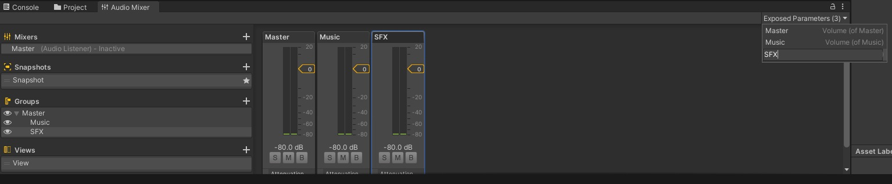
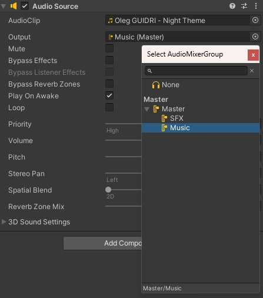

# VolumeSystem

> Разгребая легаси-проекты до 2020 года, я каждый раз изобретал велосипед, чтобы дать игроку возможность регулировать громкость.  
> Решил — хватит. Сделал систему, которую можно настроить за 2 минуты и забыть уже про велосипеды.

---

## 🔧 Как настроить

1. **В Audio Mixer создайте группу** (например, `Music` или `SFX`).  
2. **Экспонируйте параметр громкости** и дайте ему имя (например, `Music`).  
   → *Это имя — ваш **ключ**.*  
   
   

3. **На всех AudioSource укажите нужную группу** в поле **Output**.  
   

4. **На ползунок (Slider) повесьте скрипт `AudioSettingsUI`** и в поле `_key` укажите **то же имя**, что и у exposed parameter.  
   

5. **Готово.**  
   Громкость сохраняется между сценами и после перезапуска игры — через `PlayerPrefs`.

---

## 💡 Важно

- **Ключ (`_key`) должен быть одинаковым** в:
  - Имени exposed parameter в Audio Mixer
  - Поле `_key` в компоненте `AudioSettingsUI`
- Не пытайтесь использовать разные ключи для одного и того же канала — это сломает сохранение.
- Все звуки в одной группе регулируются **одновременно**. Хотите отдельную громкость — делайте отдельную группу.

---

## 📦 Что внутри

- `AudioSettingsUI.cs` — единственный скрипт.
- Демо-сцена — всё уже настроено.
- Делалось в Unity 2020.3.25f1. В соседних версиях должно работать аналогично.

---

## 📥 Как использовать

1. Скачайте `.unitypackage` 👉 [Скачать последнюю версию](https://github.com/Zubasty/VolumeSystem/releases) или скопируйте папку в свой проект.
2. Следуйте инструкции выше.

---

## 📄 Лицензия

MIT — делайте что хотите.

---

> ✨ «Это не идеально. Но это работает.»
